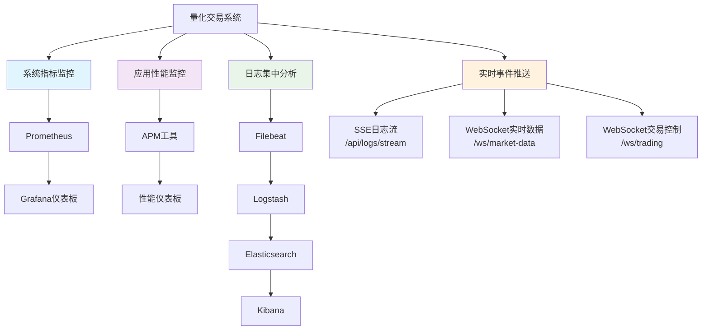

用户问了一个很好的技术选型问题：对于量化交易系统这种需要高度实时监控的场景，是应该用Prometheus/ELK这种监控方案，还是用WebSocket？用户看到了我之前提到的"现代监控方案都强调实时性"，现在想知道这些方案与WebSocket相比如何。

首先，我需要理解用户的问题核心：他们想知道在量化交易系统中，哪种实时监控技术更合适。用户可能正在设计监控架构，需要权衡不同方案。

让我先看看当前的代码上下文。用户正在查看create_app.py，其中有SSE日志流的实现。我之前解释了SSE的适用性，现在用户想知道WebSocket是否更适合。

我需要解释Prometheus/ELK与WebSocket的区别，以及它们在量化交易系统中的适用场景。Prometheus是拉取模型的指标监控，ELK是日志收集分析，WebSocket是双向实时通信。它们不是互斥的，而是互补的。

对于量化交易系统，实时监控有几个层次：1) 系统指标监控（CPU、内存、网络），2) 应用指标监控（请求数、延迟、错误率），3) 业务指标监控（订单数、成交率、持仓），4) 实时日志流，5) 实时事件推送（价格变动、交易信号）。

Prometheus适合系统指标监控，ELK适合日志分析，WebSocket适合实时事件推送。SSE适合单向实时日志流。

用户当前的SSE实现对于日志推送是合适的。如果还需要双向通信（比如前端控制交易），那么WebSocket更好。

我需要给出一个全面的回答，解释不同技术方案的适用场景，并给出具体建议。同时要考虑到用户已经实现了SSE，是否需要升级到WebSocket。

让我准备回答。
你提出了一个很好的架构设计问题。**Prometheus/ELK和WebSocket解决的是不同层面的问题**，它们不是互斥的，而是互补的。让我详细解释：

## 不同监控方案的定位

```
┌─────────────────────────────────────────────────────────────┐
│               量化交易系统监控架构全景                         │
├─────────────────────────────────────────────────────────────┤
│ 1. 系统指标监控 (Prometheus/Grafana)                         │
│    - 服务器CPU、内存、磁盘、网络                              │
│    - 进程状态、端口监听                                      │
│    - 资源使用率、负载                                      │
│    → 频率：几秒到几分钟                                      │
│    → 目的：保证系统稳定运行                                  │
│                                                                 │
│ 2. 应用性能监控 (APM工具)                                    │
│    - API响应时间、吞吐量                                    │
│    - 数据库查询性能                                        │
│    - 队列长度、缓存命中率                                    │
│    → 频率：秒级                                              │
│    → 目的：确保应用性能                                      │
│                                                                 │
│ 3. 日志集中分析 (ELK Stack)                                  │
│    - 错误日志、调试信息                                      │
│    - 审计日志、合规记录                                      │
│    - 历史日志查询、分析                                      │
│    → 频率：准实时（秒到分钟）                                │
│    → 目的：问题诊断、合规审计                                │
│                                                                 │
│ 4. 实时事件推送 (WebSocket/SSE)                              │
│    - 市场行情变化（tick数据）                                │
│    - 交易信号、订单状态                                      │
│    - 策略执行结果                                          │
│    → 频率：毫秒到秒级                                        │
│    → 目的：实时交互、决策                                    │
└─────────────────────────────────────────────────────────────┘
```

## 你的当前实现分析

你已经在使用SSE实现日志流，这是**正确的选择**：

```109:127:f:\tradeDelta\traderDelta\backend\src\create_app.py
    # SSE 日志流
    @app.route('/api/logs/stream')
    def stream_logs():
        """日志实时流（SSE）。
        
        前端通过 EventSource 或 fetch 流式读取该接口，以获得后台日志增量。
        """
        def generate():
            """生成 SSE 数据流。"""
            # 建立连接时先发送一个欢迎消息
            yield "data: [SYSTEM] Log stream connected...\n\n"
            while True:
                logs = global_log_queue.get_all()
                for log in logs:
                    # SSE 格式必须以 data: 开头，并以 \n\n 结束
                    yield f"data: {log}\n\n"
                time.sleep(0.5)
        return Response(generate(), mimetype='text/event-stream')
```

**SSE vs WebSocket对比**：

| 特性 | SSE (你的当前实现) | WebSocket | 量化交易适用性 |
|------|-------------------|-----------|----------------|
| **通信方向** | 单向（服务器→客户端） | 双向 | SSE适合日志推送，WebSocket适合交互 |
| **连接管理** | HTTP长连接，自动重连 | 独立协议，需手动重连 | SSE更简单 |
| **延迟** | 毫秒级 | 毫秒级 | 两者都满足需求 |
| **浏览器兼容** | 现代浏览器都支持 | 现代浏览器都支持 | 无差异 |
| **实现复杂度** | 简单（标准HTTP） | 复杂（协议、心跳） | SSE更易维护 |
| **数据格式** | 文本（可自定义） | 二进制或文本 | SSE适合文本日志 |

## 什么时候应该用WebSocket？

**考虑升级到WebSocket当且仅当**：

1. **需要双向通信**：
   ```javascript
   // 前端需要发送指令给后端
   ws.send(JSON.stringify({
       action: "place_order",
       symbol: "AAPL",
       quantity: 100,
       side: "buy"
   }));
   ```

2. **高频数据推送**（> 10次/秒）：
   - 实时K线图数据
   - Level 2市场深度
   - 高频交易信号

3. **需要低延迟控制**：
   - 手动交易界面
   - 策略参数调整
   - 风险控制操作

## 推荐的分层架构



## 具体实施建议

### 阶段1：保持SSE，增强功能（最简单）
```python
# 扩展当前SSE实现
@app.route('/api/market/stream')
def stream_market_data():
    """市场数据流（仍然使用SSE）"""
    def generate():
        while True:
            # 获取市场数据
            data = get_latest_market_data()
            yield f"data: {json.dumps(data)}\n\n"
            time.sleep(0.1)  # 100ms更新
    
    return Response(generate(), mimetype='text/event-stream')
```

### 阶段2：添加WebSocket（当需要双向交互时）
```python
from flask_sock import Sock

sock = Sock(app)

@sock.route('/ws/trading')
def trading_ws(ws):
    """交易WebSocket"""
    # 接收前端指令
    while True:
        message = ws.receive()
        if message:
            data = json.loads(message)
            # 处理交易指令
            result = execute_trade(data)
            # 发送结果
            ws.send(json.dumps(result))
```

### 阶段3：集成专业监控
```python
# 添加Prometheus指标
from prometheus_flask_exporter import PrometheusMetrics

metrics = PrometheusMetrics(app)
metrics.info('app_info', 'Application info', version='1.0.0')

# 自定义业务指标
orders_counter = metrics.counter(
    'orders_total', 
    'Total orders placed',
    labels={'status': lambda: get_order_status()}
)
```

## 结论

**对于你的量化交易系统**：

1. **保持当前SSE实现**：对于日志推送，SSE完全足够且更简单
2. **考虑WebSocket**：如果你需要：
   - 实时双向交易控制
   - 高频市场数据推送（> 10Hz）
   - 复杂的交互式界面
3. **添加专业监控**：对于生产环境，应该添加：
   - Prometheus + Grafana（系统指标）
   - ELK Stack（日志分析）
   - 这些与WebSocket/SSE不冲突，而是补充

**建议路线图**：
1. 先完善SSE日志流（添加过滤、分级）
2. 评估是否真的需要双向通信
3. 如果需要，添加WebSocket特定功能
4. 最后添加专业监控系统

你的当前架构是合理的，SSE对于日志推送是正确选择。只有当业务需求明确需要双向实时交互时，才考虑引入WebSocket的复杂性。